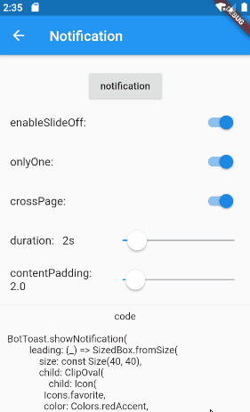
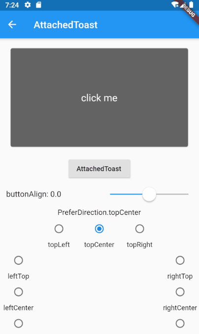
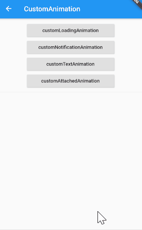
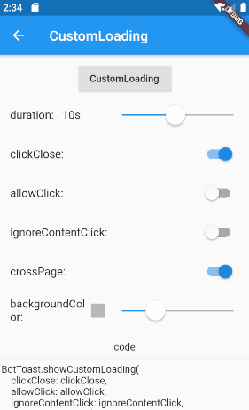
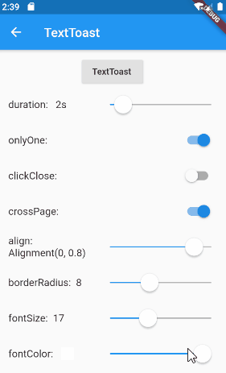

BotToast 🤖
========= 
一个真正意义上的flutter Toast库!

[](https://pub.flutter-io.cn/packages/bot_toast)

### Language: [English](README.md) | 中文简体

* [概述](#概述)
* [在线Demo](#在线demo)
* [示例项目](#示例项目)
* [效果图](#效果图)
* [快速使用](#快速使用) 
* [3.0版本](#30版本)
* [注意事项](#注意事项) 
* [主要Api文档](#主要Api文档) 

<br>

###  概述

- 真正意义上的Toast,可以在任何你需要的时候调用,不会有任何限制!

- 功能丰富,支持显示通知,文本,加载,附属等类型Toast

- 支持弹出各种自定义Toast,或者说你可以弹出任何Widget,只要它符合flutter代码的要求即可

- Api简单易用

- 纯flutter实现

- 支持全局配置


### 在线demo

**[在线例子](https://mmmzq.github.io/bot_toast/#/)** (Web效果可能有偏差,真实效果请以手机端为准,第一次加载可能会很久)

### 示例项目
**[sample project](example)**

### 效果图

Notification|Attached|CustomAnimation
--------|-------|--------
||

Loading|Text|CustomWidget
--------|-------|----------
||

### 快速使用

#### 1. pubspec.yaml文件里添加依赖
``` yaml
dependencies:
    bot_toast: ^4.1.0 #null safety
```

#### 2. 导入BotToast库
``` dart
import 'package:bot_toast/bot_toast.dart';
```

#### 3. 初始化BotToast

``` dart
MaterialApp(
      title: 'BotToast Demo',
      builder: BotToastInit(), //1.调用BotToastInit
      navigatorObservers: [BotToastNavigatorObserver()], //2.注册路由观察者
      home: XxxxPage(),
  )
```
or
``` dart
//警告:不要随意调整调用BotToastInit函数的位置
final botToastBuilder = BotToastInit();  //1.调用BotToastInit
MaterialApp(
      title: 'BotToast Demo',
      builder: (context, child) {
        child = myBuilder(context,child);  //do something
        child = botToastBuilder(context,child); 
        return child;
      }, 
      navigatorObservers: [BotToastNavigatorObserver()], //2.注册路由观察者
      home: XxxxPage(),
  )
```

#### 4. 使用BotToast
``` dart
var cancel = BotToast.showText(text:"xxxx");  //弹出一个文本框;
...
cancel();  //关闭
```

```dart
var cancel = BotToast.showSimpleNotification(title: "init"); //弹出简单通知Toast
...
cancel();  //关闭
```

```dart
var cancel = BotToast.showLoading(); //弹出一个加载动画
...
cancel();  //关闭
```

```dart
//弹出一个定位Toast
var cancel = BotToast.showAttachedWidget(
    attachedBuilder: (_) => Card(
          child: Padding(
            padding: const EdgeInsets.all(8.0),
            child: Icon(
              Icons.favorite,
              color: Colors.redAccent,
            ),
          ),
        ),
    duration: Duration(seconds: 2),
    target: Offset(520, 520));
...
cancel();  //关闭    
```

```dart
//custom api
var cancel = BotToast.showCustomNotification(...)
var cancel = BotToast.showCustomText(...)
var cancel = BotToast.showCustomLoading(...)
var cancel = BotToast.showAnimationWidget(...)
...
cancel();  //关闭
```

<br>

#### 5. 修改全局配置
  
``` dart
///例如：全局修改标准通知的动画时间为 1 秒。
BotToast.defaultOption.notification.animationDuration=const Duration(seconds: 1);

///更多默认选项参考下述配置
///[BotToast.defaultOption.simpleNotification] 对应 [showSimpleNotification] 的默认值
///[BotToast.defaultOption.notification] 对应 [showNotification] 的默认值
///[BotToast.defaultOption.customNotification] 对应 [showCustomNotification] 的默认值
///[BotToast.defaultOption.text] 对应 [showText] 的默认值
///[BotToast.defaultOption.customText] 对应 [showCustomText] 的默认值
///[BotToast.defaultOption.loading] 对应 [showLoading] 的默认值
///[BotToast.defaultOption.customLoading] 对应 [showCustomLoading] 的默认值
///[BotToast.defaultOption.attached] 对应 [showAttachedWidget] 的默认值
///[BotToast.defaultOption.animation] 对应 [showAnimationWidget] 的默认值
///[BotToast.defaultOption.enhanced] 对应 [showEnhancedWidget] 的默认值
```

### 3.0版本

#### 主要改动:

- 重新实现了底层的初始化逻辑,代码更简单,通用,并且不再依赖`Navigator`

- 初始化的方式改变(破坏性的)

####  2.x版本升级到3.x版本

将`BotToastInit`使用的位置:
``` dart
//2.x.x版本的初始化方式
BotToastInit(
  child:MaterialApp(
      title: 'BotToast Demo',
      navigatorObservers: [BotToastNavigatorObserver()],
      home: XxxxPage(),
  )
);
```

改为:
``` dart
//3.x.x版本的初始化方式
MaterialApp(
      title: 'BotToast Demo',
      builder: BotToastInit(), //BotToastInit移动到此处
      navigatorObservers: [BotToastNavigatorObserver()],
      home: XxxxPage(),
  )
```

<br>


### 注意事项

- 如果你项目有多个`Navigator`,请将该`BotToastNavigatorObserver`添加到`Navigator.observers`,否则将会影响一些功能

- 使用`ToastBuilder`方法生成widget时,请确保生成的Widget背景不会吸收点击事件,例如`Scaffold`,`Material`都会默认占满整个父空间,
并且会吸收事件(就算透明也是这种情况)


<br>

###  主要Api文档
[主要Api文档](API_zh.md)


